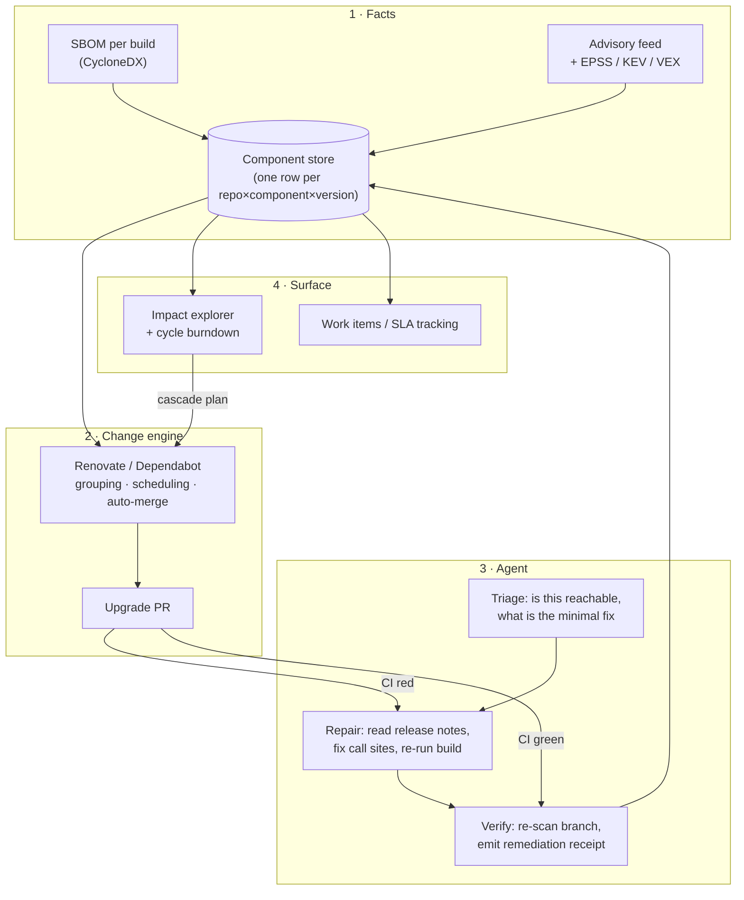

# Automating dependency upgrades with agents

A design for the recurring "upgrade the packages the scanner flagged, prove they're
fixed" cycle in an organisation with many repositories, many teams, and a mix of
internal and third-party libraries.

Written vendor-neutrally, with a mapping to the Microsoft/GitHub stack at the end.

---

## TL;DR

1. **Do not build an auto-upgrade agent first.** The version bump is the cheap part and
   two free tools already do it deterministically (Renovate, Dependabot). Adopt one,
   properly, across every repo. That alone removes most of the manual work.
2. **Spend the agent budget on the expensive part**: the PR that a bot opened and CI
   turned red. That is where humans burn days, and it is the one step an LLM is
   genuinely good at — read the migration notes, fix the call sites, re-run the build.
3. **Make "is it actually fixed?" a machine check, not a judgement call.** Re-generate
   the SBOM on the PR branch, assert the advisory is gone and no new one appeared, and
   emit a signed remediation receipt. Without this, agentic upgrading is unauditable and
   will not survive a compliance review.
4. **The UI you want is not a general dependency graph explorer.** It is three
   questions: *who consumes X?*, *what breaks if I bump internal library L?*, *where is
   this cycle's burndown?* Buy the inventory (SBOM store), build only the blast-radius
   view for internal libraries — that is the part no product handles well.
5. Build vs buy verdict: **buy/adopt everything except two pieces** — the internal
   library cascade planner and the remediation receipt job. Those are the company-specific
   glue; everything else is a configuration exercise.

---

## What the problem actually is

The remediation cycle looks like one task but is four, with very different costs:

| Step | Cost today | Automatable by | Honest difficulty |
| --- | --- | --- | --- |
| Find what is outdated / vulnerable | low | scanner | solved |
| Decide what matters | high | policy + reachability data | medium |
| Make the change | low | Renovate / Dependabot | solved |
| **Fix what the change broke** | **very high** | **agent** | **this is the real work** |
| Cascade it through internal libraries | very high | graph + orchestration | hard, and nobody sells it |
| Prove the finding is closed | medium | verification job | easy, usually skipped |

Two observations that should shape the whole design:

- **Most of the fleet's findings are transitive**, not direct. The fix is usually one
  direct parent bump, not a patch to the flagged package. Any tool that lists findings
  without collapsing them to the minimal set of direct bumps creates work rather than
  removing it.
- **Internal libraries are the hard half.** A third-party CVE is one bump in N repos and
  the repos are independent. An internal library fix is a *wave*: publish L 2.4.0, then
  the four services that consume L, then the two that consume those. Ordering matters,
  and it is the reason the cycle takes weeks rather than a day.

---

## Reference architecture

Four layers. Each is independently useful — you get value after layer 1, not after
layer 4.



---

## Layer 1 — Facts: SBOM everywhere, one store

Nothing else works without this. Today the answer to "who uses log4j 2.14?" is a
code search, which misses transitive dependencies entirely.

**Do:** add SBOM generation to every pipeline as a post-build step, in
[CycloneDX](https://cyclonedx.org/tool-center/) format, and upload it to one store.
Generate it *after* restore/resolve so you capture **resolved** versions, not manifest
ranges — the gap between the two is where every surprise lives.

- .NET — `dotnet CycloneDX` / `dotnet list package --include-transitive --format json`
- Node — `cyclonedx-npm`, or the lockfile directly
- Python — `cyclonedx-py` against the locked environment, not `requirements.txt`
- Java — `cyclonedx-maven-plugin` / gradle equivalent
- Containers — `syft` on the built image, so OS packages are covered too

**Store:** [OWASP Dependency-Track](https://dependencytrack.org/) is the obvious
off-the-shelf answer. It ingests CycloneDX, continuously re-matches every component
against advisory feeds as new CVEs land (so yesterday's clean build gets flagged today
without rebuilding), prioritises with EPSS, and has a policy engine that can fail a
build. It is free, self-hostable, and it already models the CycloneDX 1.4+ dependency
graph — direct *and* transitive.

If you'd rather not run it, the same data can land in a warehouse table and be queried
from anywhere. Minimal schema that answers everything downstream:

```
component_usage(repo, service, ecosystem, purl, version, is_direct,
                introduced_by, build_id, observed_at)
advisory(advisory_id, purl_range, severity, epss, fixed_version, kev)
remediation(finding_id, repo, pr_url, action, verified_at, evidence)
```

**Key design rule:** the store is keyed by *package URL (purl)*, not by name. `purl` is
what lets you join a Maven artifact, an npm package and a NuGet package into one
"who uses what" query without per-ecosystem special cases.

**Deliverable of this layer:** a single table that answers "who uses what, at what
version, directly or transitively." Ship this before any automation. It is also the
thing that makes the next incident (the next Log4Shell-class event) a 20-minute query
instead of a week of emails.

---

## Layer 2 — Change engine: configure, don't build

Do not write a bot that opens version-bump PRs. Two mature ones exist and both are free.

| | Dependabot | Renovate |
| --- | --- | --- |
| Setup | near zero, GitHub-native | config file, more knobs |
| Platforms | GitHub | GitHub, **Azure DevOps**, GitLab, Bitbucket |
| Monorepo / workspace | uneven | native detection, grouping |
| Grouping & scheduling | coarse | precise (group by ecosystem, by team, by window) |
| Ecosystem breadth | standard package managers | plus Terraform, Helm, Docker base images, GitHub Actions/pipeline task versions |
| Auto-merge policy | basic | rich rules, plus merge-confidence signals |
| Ops cost | none | needs a platform owner |

**Recommendation for a large mixed estate: Renovate, self-hosted.** The deciding factors
are usually not the feature list but these three:

1. If any code lives in **Azure DevOps**, Dependabot is not a real option there and
   Renovate is. Running one tool across both platforms beats running two.
2. **Grouping** is what makes this survivable at scale. "One PR per package per repo per
   week" is a review-fatigue machine. Renovate can emit *one* PR per repo per cycle for
   all patch+minor, auto-merged when CI is green, and separate PRs only for majors and
   security fixes — which is exactly the sequencing discipline you want anyway.
3. **Internal packages** need custom datasources (a private feed), which Renovate models
   explicitly.

Pick Dependabot only if you are 100% GitHub, under a few hundred repos, and want zero
platform ownership. That is a legitimate choice — it just stops being one the moment
Azure DevOps or a monorepo enters the picture.

**Configuration that matters more than the tool choice:**

```jsonc
{
  "extends": ["config:recommended"],
  "timezone": "Asia/Kolkata",
  "schedule": ["after 10pm on saturday"],        // land upgrades before the week starts
  "prConcurrentLimit": 5,                        // review fatigue is the real failure mode
  "packageRules": [
    { "matchUpdateTypes": ["patch", "minor"],
      "groupName": "routine",                    // one PR, not forty
      "automerge": true,                         // only where the repo meets the test bar
      "automergeType": "branch" },
    { "matchUpdateTypes": ["major"],
      "groupName": null, "automerge": false,
      "labels": ["needs-agent", "major"] },      // one at a time, never batched
    { "matchPackagePatterns": ["^Contoso\\."],   // internal libs: separate lane
      "groupName": "internal", "schedule": ["at any time"],
      "labels": ["internal-cascade"] },
    { "matchDatasources": ["nuget"], "registryUrls": ["https://pkgs.dev.azure.com/..."] }
  ],
  "vulnerabilityAlerts": { "labels": ["security"], "schedule": ["at any time"] }
}
```

The single highest-leverage line there is `automerge: true` on grouped patch/minor —
**gated on the repo having tests worth trusting.** Which leads to the uncomfortable but
correct rule below.

> **Auto-merge is a function of test quality, not of package risk.** A repo with a real
> test suite should auto-merge patch and minor without a human ever looking. A repo
> without one should not auto-merge anything, and the fix for that repo is tests, not a
> smarter bot. Publish the bar explicitly (e.g. line coverage over N% on changed
> assemblies + a green smoke test) and let repos opt in by meeting it. This turns
> "upgrade hygiene" into a thing teams can earn their way out of.

---

## Layer 3 — The agent: invoke on failure, not on schedule

This is the part worth building, and it should be small.

**Trigger:** a bot-authored upgrade PR whose CI is red, or a security finding with no
clean bump available. Never "run the agent over all repos nightly" — that is how you get
a five-figure token bill and a queue of PRs nobody reads.

### The loop

```
DISCOVER  read the PR diff, the failing job log, the lockfile before/after
TRIAGE    is the failure caused by this bump? which package? direct or transitive?
PLAN      fetch the release notes / migration guide for that exact version range;
          enumerate the breaking changes that touch this repo's call sites
CHANGE    minimal edit: fix call sites, not tests
VERIFY    restore → build → test → lint; on failure, one more attempt, then stop
EXPLAIN   post a structured comment: what broke, why, what changed, what is left
LAND      push to the bot's branch; a human merges (or auto-merge, if it qualifies)
```

The prompt layer for this already exists in this repo —
[`agents/nikbot-upgrade.md`](../agents/nikbot-upgrade.md) and its
[.NET](../agents/nikbot-upgrade-dotnet.md) and
[Python](../agents/nikbot-upgrade-python.md) variants encode the method: security first,
patch/minor batched, majors one at a time, verify after every step, never describe an
upgrade as complete while the suite is red. What those definitions do not have — and
what this design adds — is the orchestration and the evidence.

### Guardrails (non-negotiable)

- **The agent never merges and never publishes a package.** It pushes commits. A
  policy or a human merges.
- **The agent may not modify tests** to make them pass. If the only way to green is a
  test change, that is a human decision — label it and stop. Enforce this in CI: fail
  the agent's run if the diff touches test files without a `test-change-approved` label.
- **The agent may not skip, disable, quarantine, or `[Ignore]` a test.** Same enforcement.
- **Blast radius limit.** The agent may edit files that reference the upgraded package
  (plus the manifest/lockfile). A dependency upgrade that wants to touch 200 files is a
  refactor, and it needs a human.
- **Budget cap per PR** (attempts, tokens, wall clock). On exhaustion it writes what it
  learned and hands over — a good handover note is a successful outcome, not a failure.
- **Least privilege.** Scoped token, read code + write to the bot's own branch. No feed
  publish rights, no branch policy bypass, no ability to re-run with elevated perms.
- **Report honestly.** "Deferred: this major needs an EF Core migration review" is a
  correct answer. A green PR that only passes because a test was weakened is the failure
  mode that destroys trust in the whole programme — and it is the one you should design
  hardest against.

### What the agent is actually good at

Grounded in what breaks in practice, in rough order of frequency:

- renamed/removed APIs — mechanical, near-100% success
- namespace/package moves (e.g. `javax` → `jakarta`) — mechanical
- **changed defaults with an unchanged signature** — the most-missed class, because
  nothing fails to compile. An agent that reads release notes catches these; a human
  skimming a diff does not.
- stricter validation now rejecting input that used to pass
- tests asserting on changed error messages or types
- transitive bumps pulled in silently under a direct upgrade
- raised minimum runtime / target framework
- analyzer packages promoting warnings to errors under `TreatWarningsAsErrors`

What it is *not* good at, and should be told to defer: ORM/query-translation behaviour
changes, serializer format changes that cross a wire or a stored document, anything
where the correct fix requires knowing a business rule.

---

## The verification contract — "are those actually fixed?"

This is the half of the question that tooling usually leaves to a screenshot of a green
dashboard. Make it a job with a machine-checkable definition of done.

A finding is **closed** only when all of these hold on the PR branch:

1. The advisory ID is absent from the freshly generated SBOM for that branch.
2. The resolved version (not the manifest range) of the affected component is ≥ the fixed
   version — **including transitively**.
3. Build, full test suite and lint are green on that branch.
4. **No new advisory** was introduced by the change (compare the before/after SBOM diff).
5. A runtime smoke test passed — the package is not just present at the right version but
   loadable and exercised.

Emit the result as a **remediation receipt**, one JSON document per finding, stored
alongside the PR:

```json
{
  "finding_id": "GHSA-xxxx-xxxx-xxxx",
  "repo": "payments-api",
  "component": "pkg:nuget/Newtonsoft.Json@12.0.3",
  "action": "transitive-bump",
  "via": "pkg:nuget/Contoso.Http@4.1.0 -> 4.2.1",
  "resolved_before": "12.0.3",
  "resolved_after": "13.0.3",
  "checks": { "sbom_clean": true, "build": "pass", "tests": "pass",
              "new_advisories": 0, "smoke": "pass" },
  "actor": "agent",
  "reviewed_by": "a.human@corp",
  "pr": "https://.../pull/482",
  "verified_at": "2026-09-19T11:40:00Z"
}
```

Three things this buys you that a dashboard does not: an audit trail that answers
"prove this was remediated" in one query; a reliable **recurrence** metric (finding
closed, then reopened — the signal that a bump was reverted or a range floated back
down); and the ability to let agents work unattended on the classes of change where the
receipt is provably clean.

---

## Layer 4 — The UI

**Do not start by building a general dependency graph explorer.** A full-fleet graph is
a beautiful, unusable hairball; every organisation that builds one finds it gets opened
twice and then never again. Build the views that answer specific questions.

### The three questions that get asked

1. **"Who uses X at version Y?"** — a search box over the component store, returning
   repos, whether the use is direct or transitive, and the introducing parent. Flat
   table, sortable, exportable. This is 80% of the value and it is a week of work on top
   of layer 1.
2. **"If I bump internal library L, what is the blast radius and in what order do I
   merge?"** — the one genuinely graph-shaped view, and the one no product does well.
   Show the consumer tree from L, depth-coloured, with the topological wave order and a
   per-node status (PR open / green / red / blocked). **This is the piece worth
   building.**
3. **"Where is this cycle?"** — burndown by severity against SLA, per business unit,
   with the ageing findings surfaced. This is a dashboard, not an app: one saved query
   plus a BI report.

### Buy vs build

| Need | Adopt | Build |
| --- | --- | --- |
| Component inventory + CVE matching + policy | Dependency-Track | — |
| Service catalogue, ownership, "who owns this repo" | [Backstage](https://backstage.io/docs/features/software-catalog/creating-the-catalog-graph/) + the [catalog-graph plugin](https://roadie.io/backstage/plugins/catalog-graph/) | — |
| Org-wide vulnerability view across GitHub + Azure DevOps | Defender for Cloud (DevOps security) / GHAS security overview | — |
| Burndown, SLA, exec reporting | Power BI over the component store | — |
| **Internal library cascade planner** | nothing fits | **yes** |
| **Remediation receipts / audit trail** | nothing fits | **yes** |

Backstage is worth calling out: if you are going to have a portal, a catalogue with
ownership and relations is the right host for the impact view, and it gives you the
"who do I even ask about this repo" answer that blocks most cascades in practice. There
is no Microsoft first-party equivalent — Azure DevOps has no cross-repo dependency
graph — so this is the one place where adopting an OSS portal is the pragmatic call.

### If you build the cascade view, build this

- Nodes are **services and libraries**, not packages-times-versions. Collapse versions
  into the node and show drift as a badge; the version-level graph is unreadable.
- Default depth 2, expandable. Never render the whole fleet by default.
- Every node carries: owning team, current version, target version, PR status, and
  whether it is blocked by an upstream node. **Status is the point of the view** — an
  impact graph without live state is a picture, and pictures go stale in a day.
- One action on the node: "open upgrade PR" → fires the change engine for that repo.
  A view that only shows you the problem gets abandoned; a view you can act from does not.
- Ship the wave order as a list too. People will copy it into a plan.

---

## Internal libraries: the cascade

The mechanics that make this survivable:

1. **Topologically sort** consumers of the changed library from the component store.
   Cycles exist and are a finding in themselves — report them, don't crash.
2. **Wave 1** = direct consumers. Publish the new library version to the feed first;
   nothing can bump to a version that isn't published.
3. Open PRs for the whole wave at once, agent-assisted on failures. Wave N+1 only opens
   when wave N has merged — otherwise you get a stampede of PRs that can't go green
   because their inputs aren't published yet.
4. **Version policy for internal libraries is what actually determines the cost here.**
   Enforce semver (a breaking change in a patch release turns every cascade into an
   incident), publish real release notes (the agent reads them — an internal library
   with no changelog is the single biggest reason the agent will defer), and keep the
   supported-version window narrow and published.
5. Track a **drift metric** per internal library: median number of versions consumers lag
   behind. Drift, not CVE count, is the leading indicator. A library whose consumers lag
   six versions will produce a multi-week cascade the next time it has a CVE; one whose
   consumers lag one version produces a one-day cascade. Fixing drift *before* the
   emergency is the whole game.

**The uncomfortable structural point:** if cascades are painful, the root cause is
usually too many internal libraries with too much coupling and no semver discipline —
not a lack of automation. Automation makes a bad dependency structure survivable; it
does not make it good. Track drift and cascade depth, and if the numbers are ugly, the
correct investment is consolidating libraries, not a better agent. Say this out loud
when you pitch the programme, because it is the thing that will otherwise be discovered
in month nine.

---

## Microsoft / GitHub stack mapping

Everything below is something a Microsoft-shop MNC most likely already has entitlement to.

| Need | Use |
| --- | --- |
| Vulnerability & SCA alerts | **GitHub Advanced Security** (also available for **Azure DevOps**) |
| Upgrade PRs | **Dependabot** (GitHub) / **Renovate** (works on both) |
| Agentic upgrade | **GitHub Copilot coding agent**; **[GitHub Copilot app modernization](https://learn.microsoft.com/en-us/azure/developer/github-copilot-app-modernization/overview)** for Java/.NET — GA, agentic, does exactly the "detect breaking changes, apply build fixes, update dependencies" loop for framework upgrades (JDK, Spring Boot, .NET TFMs). If your estate is Java/.NET, **evaluate this before writing any agent of your own.** |
| Package feeds, upstream proxy, internal library hosting | **Azure Artifacts** — and its feed/download telemetry is a second, independent source for "who consumes what" |
| CI | **Azure Pipelines** / **GitHub Actions** |
| Component store & queries | **Azure Data Explorer** (Kusto) or **Microsoft Fabric**; Log Analytics if the volume is small |
| Dashboards | **Power BI** over that store; **Azure Monitor Workbooks** for an ops-flavoured view |
| Cross-platform security posture | **Microsoft Defender for Cloud — DevOps security**, which pulls GitHub and Azure DevOps findings into one pane |
| Work tracking & SLA | **Azure Boards** work item per finding, auto-created and auto-closed by the receipt job |
| Approvals / notifications | **Power Automate**, Teams adaptive cards for the "your repo has a red upgrade PR" nudge |
| Identity & access for the portal | **Entra ID** |
| Developer portal / impact UI | no first-party option — **Backstage**, or a small internal app |

Two honest gaps in the Microsoft stack: there is **no cross-repo internal dependency
graph** product, and there is **no remediation-evidence store**. Those are precisely the
two things listed as "build" above. Everything else is configuration.

---

## Rollout: 90 days

| Phase | Weeks | Deliverable | Success looks like |
| --- | --- | --- | --- |
| **0 · Inventory** | 1–2 | SBOM generation in every pipeline, landing in one store. **No automation yet.** | You can answer "who uses X" in one query, for the whole estate |
| **1 · Change engine** | 3–6 | Renovate on 10 pilot repos: grouped patch/minor, auto-merge where tests qualify, security fixes on their own lane | 60–80% of routine bumps land with no human touching them |
| **2 · Agent** | 7–10 | Agent triggered on red upgrade PRs only, with the guardrails above | Measurable "agent-rescued PR %" — target 40–60% of red PRs on the first pass |
| **3 · Receipts** | 9–12 | Verification job + receipt store + Azure Boards integration | Finding closure is evidence-backed and auditable |
| **4 · Impact UI** | 11–16 | "Who uses X" search + internal cascade planner | The next cascade is planned in an hour, not a week |
| **5 · Policy** | ongoing | SLA by severity; dependency review blocking *new* vulnerable dependencies at PR time | Inflow stops growing |

**Pick the pilot repos deliberately:** two with excellent tests (they prove auto-merge),
two with a painful internal library dependency (they prove the cascade), one legacy
(it proves the honest limits). A pilot of five easy repos tells you nothing.

Phase 5 deserves emphasis — **blocking new vulnerable dependencies at PR time is cheaper
than every phase above it.** A programme that only remediates is bailing; the dependency
review gate is the one that closes the tap.

---

## Metrics worth tracking

- **MTTR per severity**, from advisory publication (not from scan date — scan date hides
  scanner lag)
- **% of upgrades landed without human touch** — the headline automation number
- **% of red upgrade PRs rescued by the agent** on the first pass — the agent's number
- **Dependency drift**: median versions behind latest, per repo and per internal library
  — the leading indicator, and the one that predicts the next emergency
- **Recurrence rate**: findings closed then reopened — the trust-in-the-pipeline number
- **Human minutes per cycle**, per repo — the number that justifies the programme
- **Inflow vs outflow** of findings per cycle — if inflow wins, remediation speed is not
  your problem and phase 5 is where the effort belongs

---

## Failure modes, and what to do about them

| Failure mode | Mitigation |
| --- | --- |
| Auto-merge without trustworthy tests ships bugs faster | Gate auto-merge on an explicit, published test-quality bar; repos opt in by meeting it |
| PR flood → review fatigue → everything rubber-stamped | `prConcurrentLimit`, grouping, and a scheduled window. Fewer, larger, greener PRs |
| Agent "fixes" the test instead of the code | Forbid test edits without a label; enforce in CI, not in the prompt |
| Agent green-washes a red suite | The receipt is generated by CI, not by the agent. The agent cannot write its own evidence |
| Everything batched, then something breaks in prod | Majors one at a time, always. This is the oldest rule and the most frequently broken |
| Token cost balloons | Invoke on failure only; cap attempts per PR; small model for triage, large model for repair |
| Teams ignore the dashboard | Push, don't pull — Teams card to the owning team, work item with an SLA. Dashboards are for managers; developers need it in the PR |
| The graph UI goes stale and gets abandoned | Live status on every node, and one action you can take from it |
| Nine months in: cascades are still painful | Expected, if internal library structure is the real problem. Track drift and cascade depth from day one so the argument is data, not opinion |

---

## Starting point, concretely

If you do one thing this month: **turn on SBOM generation everywhere and land it in one
table.** It is unglamorous, it unblocks every other phase, and on its own it turns the
next zero-day from a week of emails into a query.

If you do two: add Renovate with grouped patch/minor auto-merge on the repos whose tests
you already trust. That is where the manual hours actually go, and no agent is needed to
recover them.

The agent comes third — and it will be much better when it arrives, because by then it
has an inventory to reason over and a verification job to prove it did no harm.
